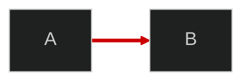

---
paths:
  - "R/**"
  - "vignettes/**"
  - "*.qmd"
  - "inst/shiny/**"
---
# Visualization Diagram Standards

Split from `visualization-standards` — covers Mermaid, flowcharts, and diagram-specific rules.

## Mermaid/Flowchart Diagrams

Mermaid diagrams are subject to the same caption requirements as plots and tables.

Every Mermaid diagram MUST:

1. Use **CDN-based Mermaid** (NOT `{mermaid}` chunks) — Quarto `{mermaid}` chunks have broken click/href (Quarto bug #10450)
2. Use **dark theme** with `securityLevel: 'loose'` for clickable nodes
3. Use `<br/>` (NOT `\n`) for multiline node labels
4. Use Quarto figure cross-reference (`::: {#fig-id}`) for captioning
5. Include `click` directives linking nodes to relevant vignettes/URLs (`_blank`)
6. Have a caption with: description, key conclusions, embedded definition links
7. Use consistent node styling per layer/category using the colour palette below

### CDN Init & Diagram Pattern

Use CDN `mermaid@11` ESM module with `startOnLoad: false`, `securityLevel: 'loose'`, `theme: 'dark'`. Init once per document, then `querySelectorAll('pre.mermaid')` and render each. Wrap in `::: {#fig-id}` for Quarto cross-refs. Use `<script type="text/plain">` inside `<pre class="mermaid">` for graph definitions. Add `click` directives for navigation and `style` per node colour palette below.

### Node Colour Palette (MANDATORY high-contrast)

**Standard:** Black background (`#000000`), gray-60 box fill (`#999999`), black text (`#000000`), red arrows/borders (`#CC0000`).

| Element | Color | Hex |
|---------|-------|-----|
| Background | Black | `#000000` |
| Node fill | Gray 60% | `#999999` |
| Node text | Black | `#000000` |
| Node border | Red | `#CC0000` |
| Arrows/lines | Red | `#CC0000` |
| Cluster/subgraph fill | Dark gray | `#333333` |
| Cluster border | Red | `#CC0000` |

All nodes use the same style: `fill:#999999,stroke:#CC0000,color:#000000`

This replaces the previous per-role colour scheme. Rationale: uniform styling maximizes readability and avoids colour-meaning ambiguity across projects.

## Plotly Legend and Theme Contrast (MANDATORY)

Every `plotly::layout()` MUST include explicit background/font colors and **legend at bottom**.

**Light theme (pkgdown, Quarto vignettes):**
```r
plotly::layout(..., paper_bgcolor = "white", plot_bgcolor = "white",
  font = list(color = "#1a1a1a"),
  legend = list(orientation = "h", xanchor = "center", x = 0.5, yanchor = "top", y = -0.15,
    font = list(color = "#1a1a1a"), bgcolor = "rgba(255,255,255,0.9)")
) |> plotly::config(scrollZoom = TRUE)
```

**Dark theme (Shiny dashboards with bslib darkly):**
```r
plotly::layout(..., paper_bgcolor = "#000000", plot_bgcolor = "#000000",
  font = list(color = "#ffffff"),
  legend = list(orientation = "h", xanchor = "center", x = 0.5, yanchor = "top", y = -0.15,
    font = list(color = "#ffffff"), bgcolor = "rgba(0,0,0,0.8)")
) |> plotly::config(scrollZoom = TRUE)
```

**Mandatory (both themes):** `orientation="h"` at bottom (`y=-0.15`), explicit bg/fg colours, `config(scrollZoom=TRUE)`.

### bslib Darkly: CSS Override Required (Lesson from 2026-04-20)

`bgcolor`/`paper_bgcolor` in `plotly::layout()` alone is **insufficient** on bslib darkly — the `.card-body` background bleeds through the SVG container. **Must add CSS:**

```css
.bslib-card .plotly .main-svg { background: #000000 !important; }
```

`paper_bgcolor` fills the SVG `<rect>` but not the outer HTML div. CSS `!important` on `.main-svg` is the only reliable fix (4 attempts to diagnose).

## Diagram Captions (MANDATORY)

**ALL diagrams MUST have captions** following the same standards as plots and tables.

Every Mermaid/flowchart diagram caption MUST include:
1. **Description**: What the diagram shows (1 sentence)
2. **Node/edge meanings**: What colors, shapes, or line styles represent
3. **Key conclusions**: 2-3 main takeaways
4. **Source function**: The R function that generates the diagram

**Example:**
```markdown
::: {#fig-pipeline}

<pre class="mermaid">...</pre>

Data pipeline showing acquisition (blue), cleaning (orange), analysis (red), and output (green) stages.
Key: Solid arrows = data flow; dashed = optional. All 10 leagues flow through the same QC process.
Source: `R/mermaid_diagrams.R::generate_data_pipeline_mermaid()`.

:::
```

## Diagram Arrow Styling

Use **RED (#CC0000)** for arrow/link colors on dark backgrounds for maximum contrast.

**Mermaid pattern:**


**Rationale:** Default grey/black arrows are invisible on dark themes. Red provides strong contrast without competing with node colors.

## Checklist

- [ ] Plotly: explicit `paper_bgcolor`, `plot_bgcolor`, `font` color set
- [ ] Plotly: legend has contrasting `font` and `bgcolor`
- [ ] Plotly: `config(scrollZoom = TRUE)` added
- [ ] **Diagrams have captions with node meanings and conclusions**
- [ ] **Diagram arrows use red (#CC0000) on dark backgrounds**
- [ ] **Every cross-reference uses hyperlinks** (not just "See Section X")
- [ ] Mermaid uses CDN init (not `{mermaid}` chunks)
- [ ] Mermaid uses dark theme with `securityLevel: 'loose'`
- [ ] Node colours use uniform gray-60 fill with red borders (per palette above)
