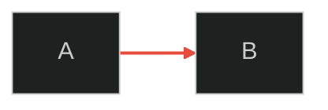

---
paths:
  - "R/**"
  - "vignettes/**"
  - "*.qmd"
  - "*.Rmd"
  - "inst/shiny/**"
  - "shiny/**"
---
# Visualization Diagram Standards

Split from `visualization-standards` — covers Mermaid, flowcharts, and diagram-specific rules.

## Mermaid/Flowchart Diagrams

Mermaid diagrams are subject to the same caption requirements as plots and tables.

Every Mermaid diagram MUST:

1. Use **CDN-based Mermaid** (NOT `{mermaid}` chunks) — Quarto `{mermaid}` chunks have broken click/href (Quarto bug #10450)
2. Use **dark theme** with `securityLevel: 'loose'` for clickable nodes
3. Use `<br/>` (NOT `\n`) for multiline node labels
4. Use Quarto figure cross-reference (`::: {#fig-id}`) for captioning
5. Include `click` directives linking nodes to relevant vignettes/URLs (`_blank`)
6. Have a caption with: description, key conclusions, embedded definition links
7. Use consistent node styling per layer/category using the colour palette below

### CDN Init Block (once per document)

```html
<script type="module">
  import mermaid from 'https://cdn.jsdelivr.net/npm/mermaid@11/dist/mermaid.esm.min.mjs';
  mermaid.initialize({
    startOnLoad: false,
    securityLevel: 'loose',
    theme: 'dark',
    themeVariables: { darkMode: true, background: '#1a1a2e' }
  });
  document.querySelectorAll('pre.mermaid').forEach(async (el) => {
    const id = el.id || 'mermaid-' + Math.random().toString(36).slice(2);
    const source = el.querySelector('script[type="text/plain"]');
    const graphDef = source ? source.textContent : el.textContent;
    const { svg } = await mermaid.render(id + '-svg', graphDef);
    el.innerHTML = svg;
  });
</script>
```

### Diagram Pattern

```markdown
::: {#fig-example}

<pre class="mermaid" id="example">
<script type="text/plain">
graph LR
  A["Input"] --> B["Output&lt;br/&gt;Data"]
  click A "input.html" _blank
  style A fill:#1a3a5c,stroke:#3498db,color:#fff
</script>
</pre>

**Description of what this diagram shows.**
Key conclusion 1. Key conclusion 2.
[Term](glossary.html#term) links to definitions.
Source: `R/file.R`.

:::
```

### Node Colour Palette (dark background, white text)

| Role | Fill | Stroke | CSS |
|------|------|--------|-----|
| Acquisition | `#1a3a5c` | `#3498db` | `fill:#1a3a5c,stroke:#3498db,color:#fff` |
| Cleaning/QC | `#4a3800` | `#f39c12` | `fill:#4a3800,stroke:#f39c12,color:#fff` |
| Analysis | `#5c1a1a` | `#e74c3c` | `fill:#5c1a1a,stroke:#e74c3c,color:#fff` |
| Outputs | `#1a4a2e` | `#27ae60` | `fill:#1a4a2e,stroke:#27ae60,color:#fff` |
| Documentation | `#3a1a4a` | `#8e44ad` | `fill:#3a1a4a,stroke:#8e44ad,color:#fff` |
| Infrastructure | `#333333` | `#7f8c8d` | `fill:#333333,stroke:#7f8c8d,color:#fff` |

## Plotly Legend and Theme Contrast (MANDATORY)

Every `plotly::layout()` call MUST include explicit background and font colors for readable legends:

```r
plotly::layout(
  ...,
  paper_bgcolor = "white",
  plot_bgcolor = "white",
  font = list(color = "#1a1a1a"),
  legend = list(..., font = list(color = "#1a1a1a"),
                bgcolor = "rgba(255,255,255,0.9)")
) |>
plotly::config(scrollZoom = TRUE)
```

Rules:
- Legend text MUST have high contrast against the plot background
- Always set `paper_bgcolor` and `plot_bgcolor` explicitly
- Always set `font = list(color = "#1a1a1a")` for dark text on light backgrounds
- Always add `plotly::config(scrollZoom = TRUE)` for interactive zoom

## Diagram Captions (MANDATORY)

**ALL diagrams MUST have captions** following the same standards as plots and tables.

Every Mermaid/flowchart diagram caption MUST include:
1. **Description**: What the diagram shows (1 sentence)
2. **Node/edge meanings**: What colors, shapes, or line styles represent
3. **Key conclusions**: 2-3 main takeaways
4. **Source function**: The R function that generates the diagram

**Example:**
```markdown
::: {#fig-pipeline}

<pre class="mermaid">...</pre>

Data pipeline showing acquisition (blue), cleaning (orange), analysis (red), and output (green) stages.
Key: Solid arrows = data flow; dashed = optional. All 10 leagues flow through the same QC process.
Source: `R/mermaid_diagrams.R::generate_data_pipeline_mermaid()`.

:::
```

## Diagram Arrow Styling

Use **RED (#e74c3c)** for arrow/link colors on dark backgrounds for maximum contrast.

**Mermaid pattern:**


**Rationale:** Default grey/black arrows are invisible on dark themes. Red provides strong contrast without competing with node colors.

## Checklist

- [ ] Plotly: explicit `paper_bgcolor`, `plot_bgcolor`, `font` color set
- [ ] Plotly: legend has contrasting `font` and `bgcolor`
- [ ] Plotly: `config(scrollZoom = TRUE)` added
- [ ] **Diagrams have captions with node meanings and conclusions**
- [ ] **Diagram arrows use red (#e74c3c) on dark backgrounds**
- [ ] **Every cross-reference uses hyperlinks** (not just "See Section X")
- [ ] Mermaid uses CDN init (not `{mermaid}` chunks)
- [ ] Mermaid uses dark theme with `securityLevel: 'loose'`
- [ ] Node colours follow the role palette above
